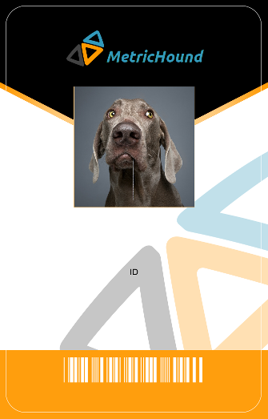

Lesson 05: Placing Text
===

Introduction
---
Let's review where we are so far. Currently, we are able to load any number of
employee records and associated photo files from disk, and perfectly position
employee photos on an id badge template. We can also automatically
generate sensible, unique filenames for the resulting id badges based on the
employees' records. 

This is a considerable amount of work, yet thanks to the power of Pillow, we've
only written a couple dozen lines of code. Can you imagine having to do
this with hundreds or thousands of employees? Can you imagine having to do each one
in PhotoShop? Let's not think about that too much; you've entered the world of
automatic batch processing and there's no turning back. Instead, think about how
you're going to spend all your free time.

In this lesson, you're going to learn how to use Pillow's `ImageDraw` module to
draw employee names onto the badges. Specifically, you'll be able to:

  - Use `ImageDraw.Draw()` to create a drawing context
  - Use `ImageDraw.ImageDraw.text()` to draw strings onto the badge image 
  - Specify the color of drawn text
  - Use Pillow's cooridnate system to calculate the x-axis offset necessary
    to center-align drawn text.

The skills you'll learn in this lesson can easily be applied to other use cases,
such as titling or captioning images, watermarking photographs, generating visible
timestamps, or even making memes.

But first, let's finish our employee id badges.

If you would like to start with code from the end of Lesson 4, check out the
branch `04-composite-images` in your working environment. If you need to set
up a fresh working environment, refer to [Lesson 1: Setup](./01-source-assets.md). 

Preview
---
This is what our id badges look like so far: 



We have the photo perfectly placed, but we're missing the employee information
such as the name, title, and id. In this lesson, we're going to draw the employee's
name on the badge. This will be the foundation for adding the rest of he information
in the following lesson.

Activity
---
Pillow draws text onto images using `ImageDraw.ImageDraw.text()`. To get familiar with
this function, let's draw employee names in white text onto the badge. 

First, we need to import Pillow's `ImageDraw` module. At the top of `badges.py`, add 
the following code in the `main()` function:

```python
from PIL import Image
from PIL import ImageDraw # Add this line
import json
```

When you want to draw text or any other type of object onto an existing `Image`
object, `ImageDraw` needs a "drawing context." In our case, the drawing context is
going to be created from the `Image` object containing `badge.png`. For example:

```python
draw = ImageDraw.Draw(employee_badge)
```

`ImageDraw.Draw()` returns an `ImageDraw` instance as a drawing context. We'll assign
this to `draw` in our code to save some typing later. 

> **Note:**
> Keep in mind that when we reference the `ImageDraw` API, we'll refer to the drawing 
> context the way the Pillow documentation does, `ImageDraw.ImageDraw`

`ImageDraw.ImageDraw.text()` takes at least 2 arguments, a tuple specifying the
location to start drawing, and the text to draw. Pillow uses a
[Cartesian coordinate system](https://en.wikipedia.org/wiki/Cartesian_coordinate_system)
to specify drawing locations.  You got a glimpse of this in Lesson 4,
when you placed the employee photo at `(185, 216)` on the badge image. Those
numbers tell Pillow, "starting from the upper-left corner of the image, count 185 pixels
to the right (the x-axis), and 216 pixels down (the y-axis). Start drawing
there."

With this in mind, let's draw the employee names at the upper-left corner of the
badge, `(0,0)`. Add these lines to the `main()` function in `badges.py`:

```python
employee_badge.paste(employee_photo, (185, 216))

# Add the following two lines
draw = ImageDraw.Draw(employee_badge)
draw.text((0,0), employee.get("first_name"))

employee_badge.save("dist/%s" % output_filename)
```

Run `badges.py` and look at the results. Open `dist/0001_jones_samantha.png` in an image
processing program or your browser.


If you look closely, you should see "Samantha" printed in tiny text in the
upper-left hand corner of the badge, exactly where we wanted it. The good news
is that we now know exactly how to place text on the badge; we just need to do some
math to figure out the right coordiantes. The bad news is that the typography
looks horrible. This is the default font that Pillow uses to draw text, and we're
going to fix that with a better-looking font in the next lesson.

First, let's look at one way to approximate better placement of an employee's
name on the badge image: start directly in the center of the badge. 

Pillow `Image` objects have `width` and `height` properties. We can derive
the exact center of the badge image by dividing its `width` and `height` values
by 2 and placing the text there.

Update the `draw.text()` call in `main()` to use these values for the position
coordinates:

```python
draw = ImageDraw.Draw(employee_badge)
# Update the following code
draw.text(
    (employee_badge.width/2, employee_badge.height/2),
    employee.get("first_name"))
```

Before you run `badges.py`, notice that the center of the badge is white, and
the default color for drawing in Pillow is also white. That means that we won't
be able to see the results of this new placement. We should paint it black.

> **Note:**
> Pillow's drawing functions can accept a variety of color arguments. RGB, HSV, tuples of
> integers, hexadecimal values, and even named color constants such as `Red` and `Black`.
> That's just the start. You can learn more about Pillow's color features in
> [Pillow's ImageDraw documentation](https://pillow.readthedocs.io/en/5.1.x/reference/ImageDraw.html#colors).

We'll specify the color black using a 3-tuple of integer values,
indicating that the red, green, and blue values will be set to zero:

```python
# Update the following code to add the color argument
draw.text(
    (employee_badge.width/2, employee_badge.height/2),
    employee.get("first_name"),
    (0,0,0))
```

If you run `badges.py` now and look at the resulting image, you'll see
"Samantha" now sits squarely in the vertical center of the badge. But it's
apparent that the coordinates for text drawing define the left-most origin of
the text, not the center:


In order to correctly center this text and all that follow, we'll have to
calculate the pixel width of the text, and then offset its origin accordingly to
center it on the badge.

Fortunately, `ImageDraw.ImageDraw` has a function for that, `textsize()`. It
takes a string as an argument, and returns the height and width of the resulting
rectangle that will contain the text when it is rendered.

Let's see what the width and height of each of our employee's first names are to
get a sense of how to use these values. Update `main()` to look like the
following:

```python
employee_badge.paste(employee_photo, (185, 216))

# Add this line to store the value in a variable
employee_name = employee.get("first_name")

draw = ImageDraw.Draw(employee_badge)
# Add these two lines to get and print the size of the name in pixels
text_width, text_height = draw.textsize(employee_name)
print(text_width, text_height)

draw.text(
    (employee_badge.width/2, employee_badge.height/2),
    employee_name,
    (0,0,0))
```

When you run `badges.py`, you'll see something like this:


Notice that the widths vary from name to name. This makes sense, as the
names do not all have the same number of characters in them, so it takes a
varying number of pixels to render them.

Now that we have these values, we can do some math. We want to shift the x-axis
coordinate of the name leftward by exactly half of its width. To accomplish this, we
will need to subtract half of the name's width from half of the badge's width. 

For example, let's assume that the badge's center point is at 100 pixels (it's not, but this
makes the example easier), and that "Samantha" is 48 pixels wide. We would
divide 48 by 2, to get 24. We would then subtract that by 100 to get 76. For
Samantha, the drawing coordinates should be `(76, employee_badge.height/2)`.

Of course, we don't want to hardcode any values. This is what a generalized
calulation would look like in code to horizontally center one rectangle inside
another:

`(employee_badge.width/2 - text_width/2), employee_badge.height/2)`

Here's a [video that illustrates this calculation](https://photos.google.com/share/AF1QipPxwLI9-7hKf2Y0j_BaGcz06RI6m7yqqQRLreifN5FcJHOw94DQmA0vpiYkwfuzhg/photo/AF1QipNqwNss-wHR4u16-uUGNASJRcr0OMyNiWr62ITl?key=N0lyTEg2RENqOUJxOFE0bFJoenhYVVJ3aElwVDln).

Modify the text drawing code to incorprate this math. Update `main()` to
look like this:

```python
employee_name = employee.get("first_name")

draw = ImageDraw.Draw(employee_badge)
text_width, text_height = draw.textsize(employee_name)

# Update replace the position argument with the new calculation
draw.text(
    ((employee_badge.width/2 - text_width/2), employee_badge.height/2),
    employee_name,
    (0,0,0))

employee_badge.save("dist/%s" % output_filename)
```

Run `badges.py` and take a look at the results. The employee names should now be
perfectly centered on the badges.


Reflection
---
In this lesson you learned how the Pillow coordinate system works, and how to
use it to place text onto an image using a drawing context. You also learned 
how to set the color of drawn text.  Unfortunately, you also learned that the 
default Pillow font is pretty ugly!

In the next lesson, you'll download two free TrueType fonts, and learn how to 
use them with `ImageFont.truetype()`. This will greatly improve the typography 
on the employee badges. 

You also learned how to calculate the origin of drawn text so that it is
horizontally centered within an image. You're going to be using this technique 
in the next lesson as you calculate the coordinates for the remaining employee
information.
